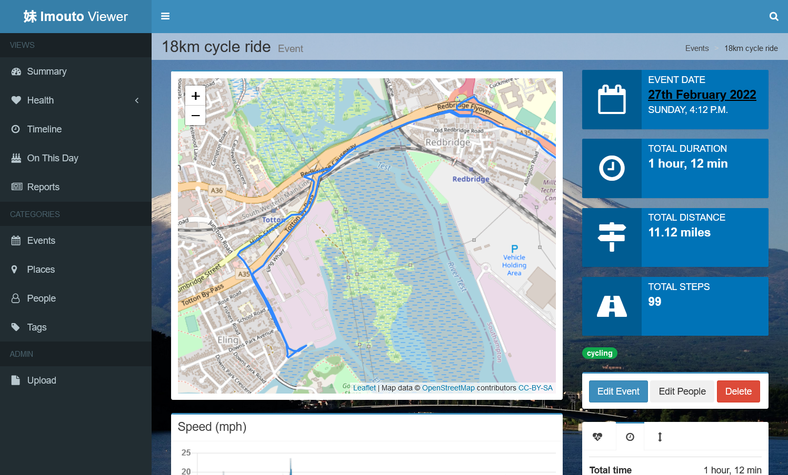

Imouto Viewer
=============

A web app for visualising life annotations and other 'quantified self' data.

Imouto
------
Imouto is a life annotation system first introduced in 
[my PhD thesis](https://eprints.soton.ac.uk/266554/1/thesis.pdf), and
later improved upon and referenced in several academic papers published by
[myself](https://eprints.soton.ac.uk/272324/1/websci11final.pdf) and
[colleagues](https://eprints.soton.ac.uk/346890/1/memorybook.pdf).
Since I left the field of computer science research,
Imouto has evolved as technology has changed. Now, rather than rely on
a companion app on a PDA for quantifiable life data, it gets the data from
a variety of different off-the-shelf tracking devices such as fitness
trackers and smartwatches. Instead of requiring a seperate Windows
application to import data from elsewhere, it now runs as background
tasks within a web application. I've also ported most of the code to
Python (specifically Django) rather than have a mish-mash of PHP, C# and
whatever else was required at the time.

For those interested, 'imouto' is the japanese word for 'little sister'.

Imouto Viewer
-------------
The viewer is the bit the user sees the most. My goal was always for the
data collection to be completely invisible - ubiquitous, if you like.
In a world where wearable computers such as fitness trackers are common,
this becomes trivial. But the data is only useful if you do something with
it, and that is the point of Imouto Viewer.

I'll be completely honest, the viewer is pretty useless on its own.
You need at least the [location manager](https://github.com/ads04r/imouto-location-manager) running as well in order to
make it do anything at all, and even then you'll just be able to import
GPS tracks into it, and have it generate events based on when you
were moving and when you were standing still, with most of the clever
stuff being done by the location manager. Where it shines is its ability
to display other types of data which - currently - you need to add
to the database yourself, either manually or using a script. And as my
current scripts are terrible, badly written and contain things like
API keys and database passwords hard-coded, I'm reluctant to release
these!

Most of the data I have is pretty unique to me (I mean, who else tracks
their steps with a Pebble, right?) but I'm hoping to come up with some
kind of framework that makes it easy for anyone to import and process
any kind of data. I've already got scripts that read Garmin FIT files
and edit features so I can get *something* out the door, and worry
about which formats I'm going to try and support later, because they
*will* change over time (and, in fact, already have, several times).
